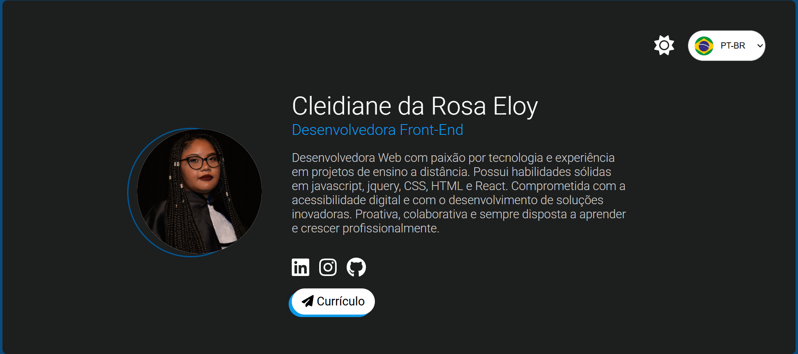

# perfil

[](https://github.com/cleidianeloy/perfil)
[](https://github.com/cleidianeloy/perfil)
(https://cleidianeloy.github.io/perfil/) <p align="center">
  
</p>

> Um portfólio web pessoal com design suave em tons de azul, destacando minha personalidade calma e a paixão pela tecnologia.

## 🚀 Demonstração

Você pode visualizar meu portfólio online aqui: [https://cleidianeloy.github.io/perfil/](https://cleidianeloy.github.io/perfil/)

## ✨ Funcionalidades Principais

* **Design Personalizado:** Interface com cores azuis suaves, elementos circulares e bordas arredondadas, refletindo uma estética calma e tecnológica.
* **Multi-idioma:** Suporte inicial para Inglês e Português, com planos de expansão para outras línguas.
* **Modo Claro/Escuro:** Alternância entre temas para uma experiência de visualização confortável em diferentes ambientes.
* **Sobre Mim:** Uma breve apresentação pessoal com links para minhas redes sociais.
* **Currículo Dinâmico:** Link para uma página com meu currículo gerado dinamicamente a partir de um arquivo JSON.
* **Navegação Fluida:** Utilização de React Router com `HashRouter` para garantir o funcionamento ideal no GitHub Pages.

## 🛠️ Tecnologias Utilizadas

* **React:** Biblioteca JavaScript para construção da interface do usuário.
* **React Router (com `HashRouter`):** Para gerenciamento de rotas no lado do cliente.
* **JSON:** Para armazenar e renderizar dinamicamente as informações do currículo.
* **Font Awesome:** Utilizada como biblioteca de icones
* **HTML5**
* **SCSS**


## ⚙️ Como Executar

Para executar este projeto localmente, siga estes passos:

1.  Clone o repositório:
    ```bash
    git clone https://github.com/cleidianeloy/perfil.git
    ```
2.  Navegue até o diretório do projeto:
    ```bash
    cd perfil
    ```
3.  Instale as dependências:
    ```bash
    npm install 
    ```
4.  Inicie o servidor de desenvolvimento:
    ```bash
    npm start  
    ```
5.  Abra seu navegador em [http://localhost:3000](http://localhost:3000) para visualizar o portfólio.

## 📬 Contato
📧 [cleidianeloy@hotmail.com](mailto:cleidianeloy@hotmail.com)
